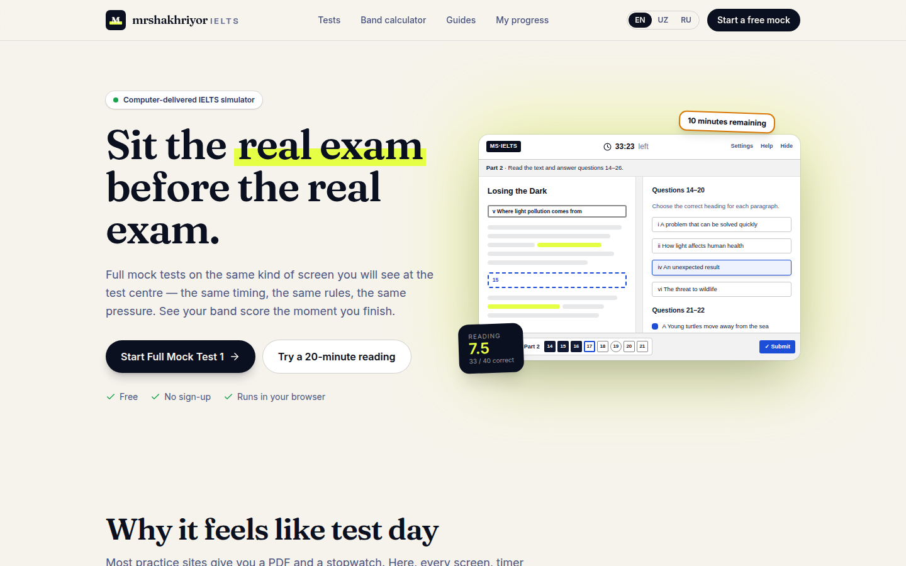
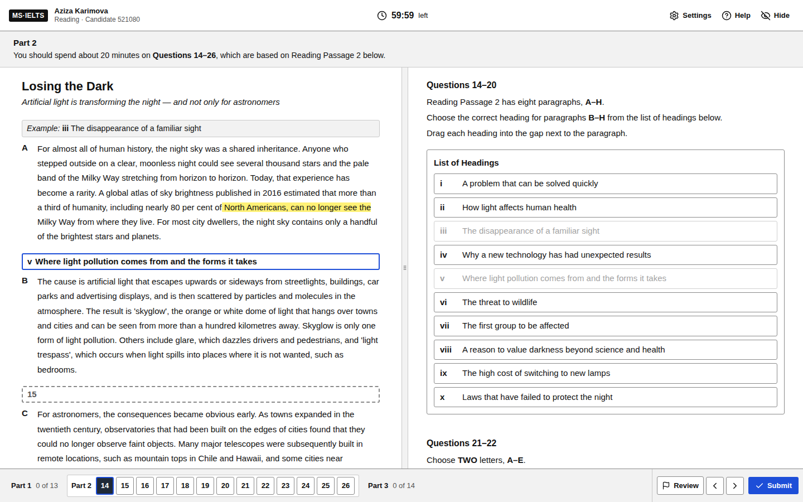
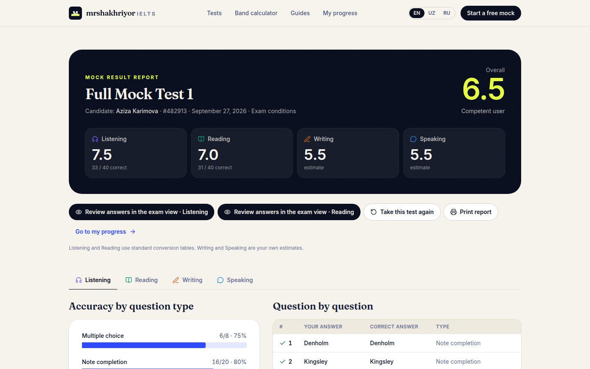

# mrshakhriyor IELTS

**The real exam, before the real exam.** A computer-delivered IELTS simulator: full mock tests on the same kind of screen students see at the test centre, with the same timing, the same rules and an instant band score.



| Reading test (split screen, drag-and-drop headings, highlighting) | Result report |
| --- | --- |
|  |  |

## What makes it feel like test day

- **The computer-delivered layout** — passage on the left, questions on the right, a resizable divider, a question navigator along the bottom with *Review* flags, settings for text size and colour contrast, *Help* and *Hide* buttons.
- **Strict timing** — Listening follows the recording plus 2 minutes to check, Reading and Writing get 60 minutes each, warnings appear at 10 and 5 minutes and answers are submitted automatically at zero. The clock survives a page refresh.
- **Listening plays once** — real multi-voice recordings with the exam's reading and checking pauses; no pause or replay in exam mode. After an accidental refresh the audio resumes where the clock says it should be.
- **All the question types** — True/False/Not Given, Yes/No/Not Given, multiple choice (one or several answers), note, form, table, flow-chart, sentence and summary completion, word-box summaries, matching headings (dropped into the passage), matching features and sentence endings, map labelling and short answers. Drag-and-drop also works by tapping on phones.
- **Highlighting and notes** — select any text to highlight it or pin a note, or right-click as in the real test.
- **Writing without help** — no spell-check or autocorrect, a live word count, both tasks in one hour.
- **A speaking interview** — an examiner voice asks the questions, Part 2 has the cue card with a one-minute preparation timer, and every answer is recorded for the candidate to play back.
- **Exam or practice mode** — practice mode removes the clock and lets candidates pause the audio and ask the examiner to repeat questions.

## After the test

- **Band scores** for Listening and Reading straight away (standard conversion tables, Academic or General Training), and an overall band with the official rounding rule.
- **Answer review in the exam interface** — every question marked, with the sentence that contains the answer highlighted in the passage or transcript. Listening transcripts can be replayed line by line.
- **Writing feedback** — instant checks (word count, paragraphs, overview or position, linking words, repetition, informal language), a band-8.5 model answer and a guided self-assessment against the four official criteria. Essays can be copied or downloaded for the teacher.
- **Speaking playback** — every recorded answer, downloadable, plus a self-assessment.
- **Progress page** — band history per skill, the question types that cost the most marks, unfinished tests, and a backup file to move progress to another device.

The site is available in **English, O‘zbekcha and Русский**. The exam itself is always in English, as on test day.

## Quick start

Requires Node.js 22.22 or newer.

```bash
npm install
npm run dev          # http://localhost:5173
```

| Command | What it does |
| --- | --- |
| `npm run dev` | Development server with hot reload |
| `npm run build` | Type-check and build the static site into `dist/` |
| `npm run preview` | Serve the production build locally |
| `npm run check` | Lint, type-check, unit tests and build — everything CI runs except the browser tests |
| `npm test` | Unit tests (scoring, band tables, answer keys, content integrity) |
| `npm run test:e2e` | Browser tests with Playwright (run `npx playwright install chromium` once first) |
| `npm run audio:export` / `audio:generate` | Turn listening scripts and speaking prompts into MP3s — see [Audio](#audio) |

## Make it yours

Edit **`src/site.config.ts`**: brand name, teacher name and bio, and your Telegram, Instagram and email links (empty links are hidden). The colours and fonts live in `src/index.css`.

## Adding a test

Every test is plain data in `src/content/tests/`. Copy `mock-1/` to `mock-2/`, edit the four files, and register the test in `src/content/tests/index.ts`:

```ts
export const TESTS: TestDef[] = [mock1, mock2, practiceWhale]
```

A question group is a small object. For example, a gap-fill:

```ts
{
  id: 'r1-g2',
  type: 'gap',
  layout: 'notes', // notes | form | sentences | summary | table | flowchart
  from: 8,
  to: 13,
  wordLimit: { words: 2 }, // "NO MORE THAN TWO WORDS"
  instructions: ['Complete the notes below.', 'Choose **NO MORE THAN TWO WORDS** from the passage for each answer.'],
  lines: ['# Heading', '- The colony leaves with two-thirds of the {{8}}.'],
}
```

and its answers go in the section's `answers` map:

```ts
8: { accept: ['workers'], evidence: 'The old queen departs with roughly two-thirds of the workers' },
```

- `accept` lists every acceptable answer; `(the) town hall` makes a word optional.
- `evidence` is an exact quote from the passage or transcript — it is highlighted in the answer review.
- `explanation` (optional) is shown under the answer in the review.
- Markup in any text: `**bold**`, `*italic*`, `{{12}}` for the gap of question 12.

The type definitions in `src/types/content.ts` document every question type. **Run `npm test` after editing**: the content tests check that questions run 1–40 without gaps, that every question has a valid answer, that option letters exist, that typed answers fit the word limit, and that every evidence quote appears word for word in the text. Maps and diagrams are React components registered in `src/content/visuals/`.

## Audio

Listening recordings and the speaking examiner's voice are generated from the scripts with [Kokoro](https://github.com/thewh1teagle/kokoro-onnx), an open-source text-to-speech model (Apache-2.0), in British and American voices at about 160 words per minute. Generated MP3s are committed in `public/audio/`, so nothing needs to be installed to run the site.

To (re)generate after changing a script:

```bash
python3 -m venv scripts/.tts/venv
scripts/.tts/venv/bin/pip install -r scripts/requirements-audio.txt
curl -L -o scripts/.tts/kokoro-v1.0.onnx https://github.com/thewh1teagle/kokoro-onnx/releases/download/model-files-v1.0/kokoro-v1.0.onnx
curl -L -o scripts/.tts/voices-v1.0.bin  https://github.com/thewh1teagle/kokoro-onnx/releases/download/model-files-v1.0/voices-v1.0.bin

npm run audio:export     # scripts → scripts/.audio-jobs.json
npm run audio:generate   # → public/audio/*.mp3 + src/content/audio-manifest.json
```

Only changed parts are re-rendered. Each script line can have a `say` field when the spoken form differs from the transcript (for example `"07946 218530"` is spoken as `"oh seven nine four six …"`), and `scripts/export-audio-jobs.ts` holds a small pronunciation dictionary and per-voice speaking rates.

To use **your own recordings** instead, save the MP3 at the same path in `public/audio/` and update its `duration` in `src/content/audio-manifest.json` (the transcript line highlighting in the review uses the stored timings, so it will be approximate).

## Deploying

The build is a static site, so it can be hosted anywhere.

**GitHub Pages (included):** in the repository settings open *Pages* and set *Source* to **GitHub Actions**. Every push to `main` then builds and publishes the site through `.github/workflows/deploy.yml`, at `https://<user>.github.io/<repo>/`, or at your own domain if you add one in the same settings page.

**Netlify / Vercel:** import the repository, build command `npm run build`, output directory `dist`. `public/_redirects` and `vercel.json` already route every page to the app.

## How scoring works

- Listening and Reading use the widely published raw-score tables (Academic and General Training reading differ). The 13-question practice set is projected onto 40 questions.
- Multi-answer questions ("Choose TWO letters") give one mark per correct letter, in any order.
- Typed answers are case-insensitive; spelling must be exact, as in the real test. Answers over the word limit are wrong and are flagged in the review.
- The overall band is the mean of the four skills rounded to the nearest half band (.25 rounds up to .5, .75 up to the next band).
- Writing and Speaking bands are **self-assessed** against the four criteria (Task 2 counts double in Writing), so they are estimates. For an examiner-quality band, send the essay or recording to a teacher.

## Data and privacy

There are no accounts and no server: answers, results and settings are stored in the browser's local storage, and speaking recordings in IndexedDB. Students can export a backup file from *My progress* and import it on another device.

## Project structure

```
src/
  content/        tests, audio manifest, guides, maps and band descriptors
  exam/           the test interface: shell, reading, listening, writing, speaking, question types, highlighting
  lib/            scoring, band tables, answer matching, attempts, storage, writing analysis
  pages/          home, test library, test details, exam, results, review, progress, calculator, guides
  i18n/           English, Uzbek and Russian text for the website
scripts/          audio generation
e2e/              Playwright browser tests
```

Built with React 19, TypeScript, Vite, Tailwind CSS 4 and React Router.

## Notes

- IELTS is a registered trademark of the British Council, IDP IELTS and Cambridge University Press & Assessment. This is an independent practice platform and is not affiliated with or endorsed by them; the interface is modelled on the computer-delivered test to prepare candidates for it.
- *Full Mock Test 1* (passages, questions, recordings, prompts and model answers) is original material written for this site.
- The reading passage *The Whale Goes to Court* and the daily reading *The Science of Fatherhood* (an excerpt of a New Scientist review) were carried over from the original prototype page. Check that you have the right to publish them before making the site public.
